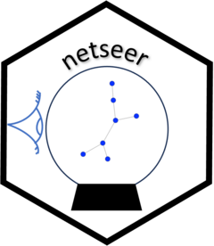

<!-- README.md is generated from README.Rmd. Please edit that file -->

# Predicting graph structure from a time series of graphs 

<!-- badges: start -->

[](https://github.com/sevvandi/netseer/actions/workflows/R-CMD-check.yaml)
<!-- badges: end -->

If you have a time series of dynamic graphs with changing structure, how
would you predict future graphs? This is the goal of netseer.

Netseer predicts the graph structure including new nodes and edges from
a time series of graphs. It adapts Flux Balance Analysis, a method used
in metabolic network reconstruction to predict the structue of future
graphs. The methodology is explained in the preprint (Kandanaarachchi et
al. 2025).

## R package

The algorithm is available in both R and Python. The R package `netseer`
in on CRAN and can be installed as follows:

``` r
install_packages("netseer")
```

The vignette for the R package is available under \[Get Started\] at
<https://sevvandi.github.io/netseer/>

## Python package

The Python package is available from PyPI at
<https://pypi.org/project/netseer/>. The Python package can be installed
as follows:

``` python
pip install netseer
```

The documentation for the Python package is available at
<https://sevvandi.github.io/netseer-python/>.

## Coding Credits

A big shout out to Stefan Westerlund and Brodie Oldfield for their
contributions. Stefan optimized the algorithm in R and coded it from
scratch in Python. Brodie packaged up the Python code and did the
website for the Python version.

## References

<div id="refs" class="references csl-bib-body hanging-indent"
entry-spacing="0">

<div id="ref-kand2025graphpred" class="csl-entry">

Kandanaarachchi, Sevvandi, Ziqi Xu, Stefan Westerlund, and Conrad
Sanderson. 2025. “Predicting Graph Structure via Adapted Flux Balance
Analysis.” <https://arxiv.org/abs/2507.05806>.

</div>

</div>
